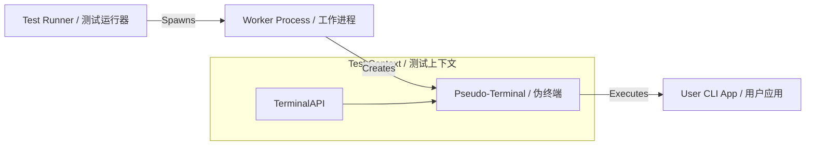

# Repterm - CLI/TUI Test Framework
# Repterm - CLI/TUI 测试框架

A TypeScript-based test framework for terminal and CLI applications, featuring a Modern, Declarative API, terminal recording capabilities, and parallel test execution.

一个基于 TypeScript 的终端和 CLI 应用测试框架，提供现代声明式 API、终端录制能力以及并行测试执行功能。

---

## Core Value / 核心价值

Why choose Repterm? / 为什么选择 Repterm？

- **Visual Verification / 可视化验证**:Unlike traditional CLI tests that only capture stdout, Repterm runs in a real PTY, capturing colors, cursor movements, and full terminal state.
  与仅捕获标准输出的传统 CLI 测试不同，Repterm 在真实的 PTY 中运行，能够捕获颜色、光标移动和完整的终端状态。

- **Record & Replay / 录制与回放**: Every test run can be recorded as an asciinema cast. Debugging CI failures becomes as easy as watching a video.
  每次测试运行都可以录制为 asciinema 视频。调试 CI 失败就像看视频一样简单。

- **Zero Config TypeScript / 零配置 TypeScript**: Write tests in `.ts` files immediately. No complex `tsconfig` or compilation steps required.
  直接编写 `.ts` 测试文件，无需复杂的 `tsconfig` 或编译步骤。

## Features / 功能特性

- **Modern, Declarative API**: Familiar `test()`, `expect()`, and `describe()` syntax.
  **现代声明式 API**: 熟悉的 `test()`, `expect()`, `describe()` 语法。
  
- **Parallel Execution**: Run tests concurrently in isolated workers for maximum speed.
  **并行执行**: 在隔离的 worker 中并发运行测试，实现极速执行。

- **Multi-terminal Support**: Test complex scenarios involving multiple interacting terminal sessions.
  **多终端支持**: 测试涉及多个交互终端会话的复杂场景。

## Quick Start / 快速开始

### Prerequisites / 前提条件

- Node.js 20.11.0+
- `asciinema` (Optional, for recording / 可选，用于录制)
- `tmux` (Optional, for multi-terminal / 可选，用于多终端)

```bash
# macOS
brew install asciinema tmux

# Ubuntu/Debian
apt-get install asciinema tmux
```

### Installation / 安装

```bash
npm install repterm --save-dev
```

### Writing Your First Test / 编写第一个测试

Create a file `tests/hello.test.ts` / 创建文件 `tests/hello.test.ts`:

```typescript
import { test, expect } from 'repterm';

test('echo command', async ({ terminal }) => {
  // Execute a command in the PTY / 在 PTY 中执行命令
  await terminal.run('echo "Hello, Repterm!"');

  // Verify output / 验证输出
  await terminal.waitForText('Hello, Repterm!');
  
  // Assertions / 断言
  await expect(terminal).toContainText('Hello, Repterm!');
});
```

### Running Tests / 运行测试

```bash
# Run all tests / 运行所有测试
npx repterm tests/

# Run with recording / 启用录制运行
npx repterm --record tests/

# Run in parallel / 并行运行
npx repterm --workers 4 tests/
```

## Architecture / 架构概念

How Repterm works / Repterm 如何工作：



1. **Runner**: Discovers tests and manages worker processes.
   **运行器**: 发现测试并管理工作进程。
2. **Worker**: an isolated environment for each test file.
   **工作进程**: 每个测试文件的隔离环境。
3. **PTY**: Simulates a real terminal, handling ANSI codes and interactivity.
   **伪终端**: 模拟真实终端，处理 ANSI 转义码和交互。

## Documentation / 文档

- [Quickstart Guide / 快速入门指南](specs/001-tui-test-framework/quickstart.md)
- [TypeScript Support / TypeScript 支持](TYPESCRIPT-SUPPORT.md)
- [Recording Implementation / 录制实现](RECORDING-IMPLEMENTATION.md)

## Examples / 示例

Check out the [examples directory](packages/repterm/examples/README.md) for more usage scenarios.
查看 [示例目录](packages/repterm/examples/README.md) 获取更多使用场景。

## License / 许可证

MIT
