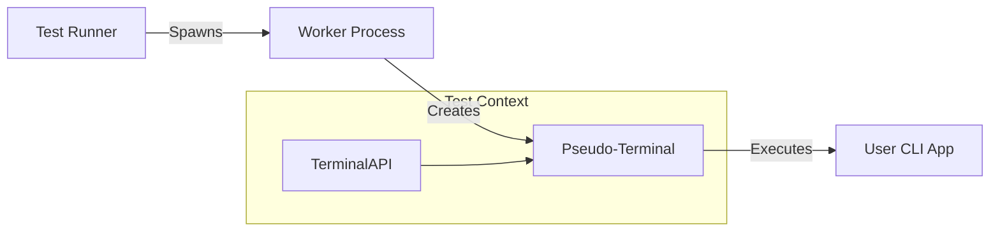

# Repterm - CLI/TUI Test Framework

A TypeScript-based test framework for terminal and CLI applications, featuring a modern, declarative API, terminal recording capabilities, and parallel test execution.

---

## Core Value

Why choose Repterm?

- **Visual Verification**: Unlike traditional CLI tests that only capture stdout, Repterm runs in a real PTY, capturing colors, cursor movements, and full terminal state.

- **Record & Replay**: Every test run can be recorded as an asciinema cast. Debugging CI failures becomes as easy as watching a video.

- **Zero Config TypeScript**: Write tests in `.ts` files immediately. No complex `tsconfig` or compilation steps required.

## Features

- **Modern, Declarative API**: Familiar `test()`, `expect()`, and `describe()` syntax.

- **Parallel Execution**: Run tests concurrently in isolated workers for maximum speed.

- **Multi-terminal Support**: Test complex scenarios involving multiple interacting terminal sessions.

## Quick Start

### Prerequisites

- Node.js 20.11.0+
- `asciinema` (Optional, for recording)
- `tmux` (Optional, for multi-terminal)

```bash
# macOS
brew install asciinema tmux

# Ubuntu/Debian
apt-get install asciinema tmux
```

### Installation

```bash
npm install repterm --save-dev
```

### Writing Your First Test

Create a file `tests/hello.test.ts`:

```typescript
import { test, expect } from 'repterm';

test('echo command', async ({ terminal }) => {
  // Execute a command in the PTY
  await terminal.run('echo "Hello, Repterm!"');

  // Verify output
  await terminal.waitForText('Hello, Repterm!');

  // Assertions
  await expect(terminal).toContainText('Hello, Repterm!');
});
```

### Running Tests

```bash
# Run all tests
npx repterm tests/

# Run with recording
npx repterm --record tests/

# Run in parallel
npx repterm --workers 4 tests/
```

## Architecture

How Repterm works:



1. **Runner**: Discovers tests and manages worker processes.
2. **Worker**: An isolated environment for each test file.
3. **PTY**: Simulates a real terminal, handling ANSI codes and interactivity.

## Documentation

- [Quickstart Guide](specs/001-tui-test-framework/quickstart.md)
- [TypeScript Support](TYPESCRIPT-SUPPORT.md)
- [Recording Implementation](RECORDING-IMPLEMENTATION.md)

## Examples

Check out the [examples directory](packages/repterm/examples/README.md) for more usage scenarios.

## License

MIT
