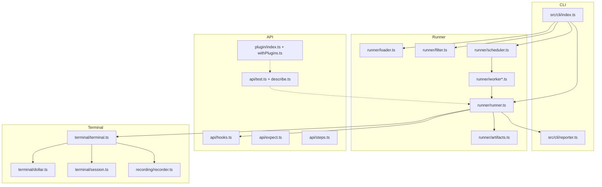
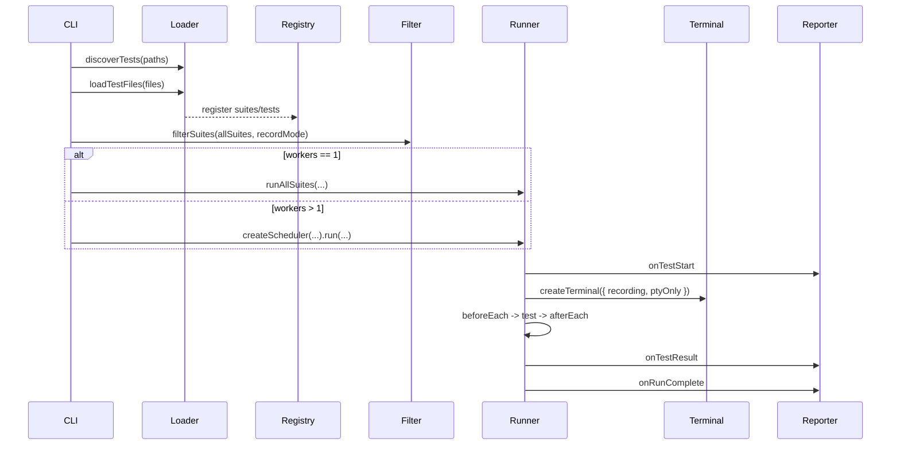

# Repterm architecture

## 1. Layers

## 2. End-to-end flow

## 3. Terminal mode (current)

In runTest() (runner/runner.ts):

- `testRecordConfig = test.options.record ?? inheritedSuiteRecord`
- `cliRecordMode = config.record.enabled`
- `shouldRecord = cliRecordMode && testRecordConfig`
- `shouldUsePtyOnly = testRecordConfig && !cliRecordMode`

terminal.$\`cmd\` / terminal.run() paths:

| Scenario | Execution | Result |
| --- | --- | --- |
| Default (non-interactive) | Bun.spawn | reliable code |
| PTY-only | PTY | code often -1 |
| Recording | asciinema + tmux + PTY | produces .cast |
| Interactive | PTY | expect/send/interrupt |
| silent: true | Bun.spawn | for JSON/exit code |

## 4. API and plugins

- Entry: `packages/repterm/src/index.ts`
- DSL: `test/describe/step/hooks`
- Assertions: expect.extend() for terminal and command matchers
- Plugins:
  - definePlugin(name, setup)
  - defineConfig({ plugins }) for runtime
  - createTestWithPlugins(config) injects ctx.plugins.*

## 5. Kubectl plugin

- Core: `packages/plugin-kubectl/src/index.ts`
- Matchers: `packages/plugin-kubectl/src/matchers.ts`
- Examples: `packages/plugin-kubectl/examples/*.ts`

Plugin: CRUD, wait, rollout, watch, port-forward, events/nodes/cp; matchers toHaveReadyReplicas, toHaveStatusField, etc.

## 6. Code navigation

- CLI/flow: `packages/repterm/src/cli/index.ts`
- Filter: `packages/repterm/src/runner/filter.ts`
- Lifecycle: `packages/repterm/src/runner/runner.ts`
- Terminal: `packages/repterm/src/terminal/terminal.ts`
- Plugins: `packages/repterm/src/plugin/index.ts`
- Unit tests: `packages/repterm/tests/unit/*.test.ts`

## See Also

- [runner-pipeline.md](runner-pipeline.md)
- [terminal-modes.md](terminal-modes.md)
- [api-cheatsheet.md](api-cheatsheet.md)
