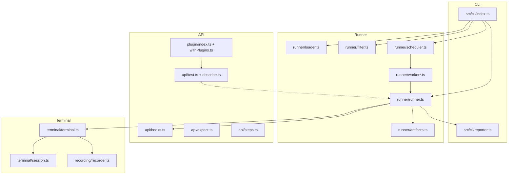
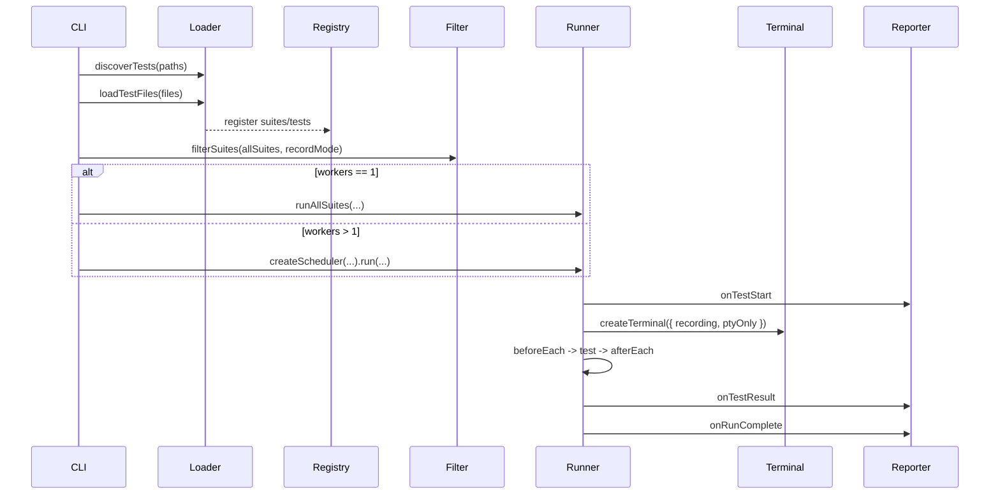

# Repterm 架构速览

## 1. 分层结构

## 2. 端到端执行链路

## 3. 终端模式判定（当前实现）

在 `runTest()`（`runner/runner.ts`）中：

- `testRecordConfig = test.options.record ?? inheritedSuiteRecord`
- `cliRecordMode = config.record.enabled`
- `shouldRecord = cliRecordMode && testRecordConfig`
- `shouldUsePtyOnly = testRecordConfig && !cliRecordMode`

对应 `terminal.run()` 的执行路径：

| 场景 | 执行方式 | 结果特征 |
| --- | --- | --- |
| 默认（非交互） | `Bun.spawn` | `code` 可可靠断言 |
| PTY-only | PTY | 通常 `code = -1` |
| Recording | `asciinema + tmux + PTY` | 生成 `.cast` |
| Interactive | PTY | 支持 `expect/send/interrupt` |
| `silent: true` | 强制 `Bun.spawn` | 适合 JSON/退出码校验 |

## 4. API 与插件关系

- 公共入口：`packages/repterm/src/index.ts`
- DSL：`test/describe/step/hooks`
- 断言：`expect.extend(...)` 内置终端与命令结果 matcher
- 插件系统：
  - `definePlugin(name, setup)` 定义插件
  - `defineConfig({ plugins })` 创建 runtime
  - `createTestWithPlugins(config)` 自动注入 `ctx.plugins.*`

## 5. Kubectl 插件接入点

- 核心：`packages/plugin-kubectl/src/index.ts`
- Matcher：`packages/plugin-kubectl/src/matchers.ts`
- 示例：`packages/plugin-kubectl/examples/*.ts`

插件方法涵盖资源 CRUD、wait、rollout、watch、port-forward、events/nodes/cp，并扩展 `toHaveReadyReplicas`、`toHaveStatusField` 等 matcher。

## 6. 代码导航建议

- CLI/执行流：`packages/repterm/src/cli/index.ts`
- 过滤逻辑：`packages/repterm/src/runner/filter.ts`
- 生命周期：`packages/repterm/src/runner/runner.ts`
- 终端实现：`packages/repterm/src/terminal/terminal.ts`
- 插件系统：`packages/repterm/src/plugin/index.ts`
- 单测入口：`packages/repterm/tests/unit/*.test.ts`

## See Also

- [runner-pipeline.md](runner-pipeline.md)
- [terminal-modes.md](terminal-modes.md)
- [api-cheatsheet.md](api-cheatsheet.md)
