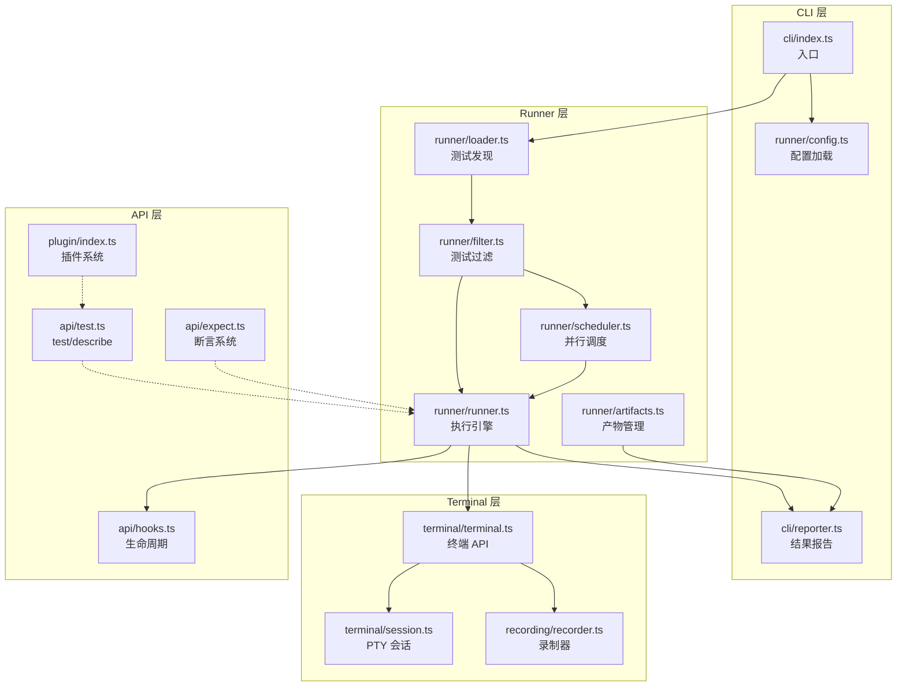
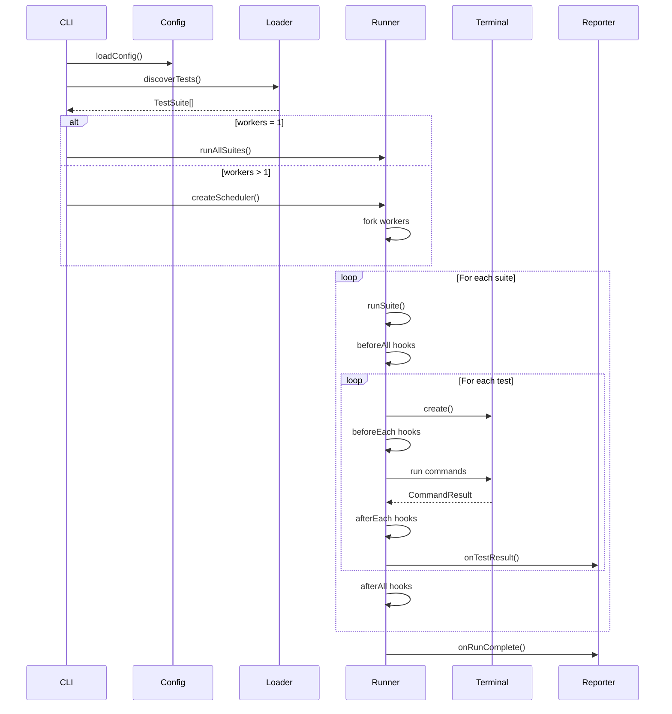
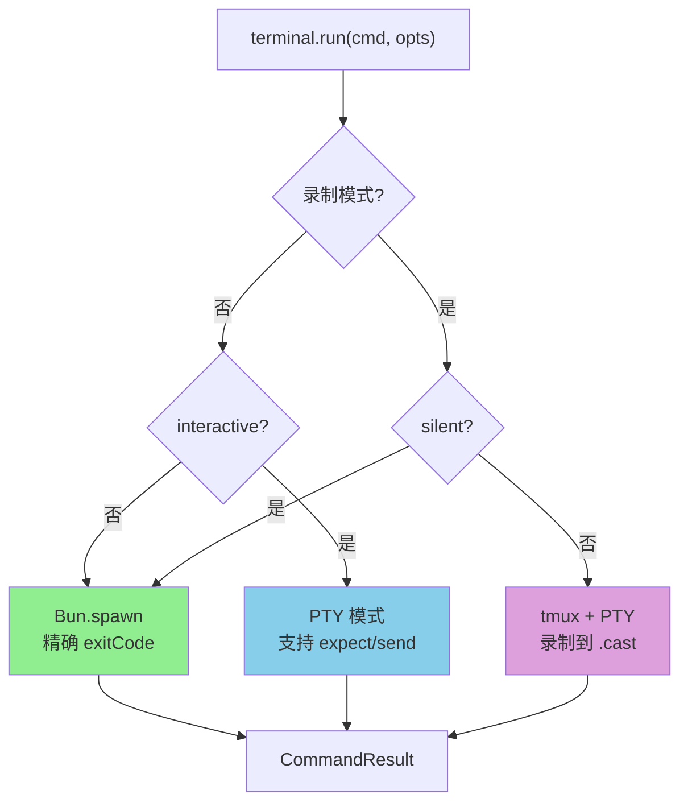

# Repterm 架构速览

## 系统架构图

## 执行流程图

## 终端模式决策图

## 1. CLI → Runner 管线
1. CLI 入口 `packages/repterm/src/cli/index.ts`：
   - 解析命令行参数（record/workers/timeout/verbose 等）。
   - `loadConfig`（`packages/repterm/src/runner/config.ts`）融合默认配置。
   - `createArtifactManager`（`packages/repterm/src/runner/artifacts.ts`）生成 run 目录。
   - `discoverTests` / `loadTestFiles`（`packages/repterm/src/runner/loader.ts`）注册 suite。
   - 根据 `--record` 使用 `filterSuites`（`packages/repterm/src/runner/filter.ts`）筛选测试。
   - Worker=1：`runAllSuites`; Worker>1：`createScheduler`.
   - `createReporter` 订阅 `onTestStart` / `onTestResult` / 结束汇总。

2. Runner (`packages/repterm/src/runner/runner.ts`)：  
   - `runSuite` 采用“洋葱”模型：`beforeAll` → 自身测试 → 子 suite → `afterAll`。  
   - `runTest`：创建终端 → 解析 fixture（`hooksRegistry.runBeforeEachFor`）→ 执行 `test.fn` → `hooksRegistry.runAfterEachFor` 清理 → `RunResult`。

3. 并行调度 (`packages/repterm/src/runner/scheduler.ts` + `worker.ts` + `worker-runner.ts`)：  
   - Scheduler 预热多个 worker 子进程，分发 suite。  
   - Worker 内构建 ArtifactManager + `runSuite`，实时通过 IPC 发送 `result/done/error` 事件。  
   - 主进程聚合结果并交给 Reporter。

## 2. Terminal/Recording 层
1. `Terminal` (`packages/repterm/src/terminal/terminal.ts`)：  
   - 懒初始化 `TerminalSession`（`packages/repterm/src/terminal/session.ts`）。  
   - 非录制：直接 `Bun.spawn` 执行命令（stdout/stderr 分离）。  
   - 录制或交互：通过 tmux pane + `PTYProcessImpl`，`waitForText` 依赖 `capture-pane`。  
   - `terminal.create()` 在 tmux 中拆分 pane，并共享 `SharedTerminalState` 追踪 pane 输出。  
   - `close()` 负责发送 `Ctrl+B d` + `tmux kill-session`，确保 asciinema 收尾。

2. Recorder (`packages/repterm/src/recording/recorder.ts`)：  
   - `asciinema rec --command "tmux new -s <session>" <cast>` 开启录制；`stop()` 发 SIGTERM。  
   - CLI record 模式前置 `checkDependencies`（`packages/repterm/src/utils/dependencies.ts`）。

## 3. API/插件层
1. API 入口 `packages/repterm/src/index.ts` 输出：  
   - 核心 DSL (`test`, `expect`, `describe`, `step`, hooks)。  
   - Runner 类型定义、Plugin 工厂。  
   - 把 `step`/`describe` 附加到 `test`.

2. 插件机制 (`packages/repterm/src/plugin/index.ts`, `withPlugins.ts`)：  
   - `definePlugin` 描述 `setup()`，可返回 `methods`、`context`、`hooks`。  
   - `PluginRuntime.initialize` 收集插件输出，注入到 `AugmentedTestContext`.  
   - `createTestWithPlugins` & `describeWithPlugins` 包装 `test`/`describe`，自动执行插件 hooks。

3. Kubectl 插件示例：  
   - `packages/plugin-kubectl/src/index.ts` 定义 kubectl 操作、上下文、Rollout/PortForward API。  
   - `packages/plugin-kubectl/src/matchers.ts` 注册 `expect` 扩展（`toBeRunning`、`toExistInCluster` 等）。  
   - 示例脚本在 `packages/plugin-kubectl/examples/*.ts`。

## 4. Reporter & Artifact
- Reporter (`packages/repterm/src/cli/reporter.ts`)：以 Vitest 风格打印 suite/test，支持慢测试阈值、失败详情。  
- ArtifactManager (`packages/repterm/src/runner/artifacts.ts`)：  
  - `init()` 创建 `artifacts/<runId>/`；  
  - 提供 `getCastPath/getLogPath/getSnapshotPath`；  
  - Scheduler 中每个 worker 会获取独立 runId，防止录制/日志冲突。

## 5. 参考路径速查
- `packages/repterm/src/api/*`：DSL、断言、hooks。  
- `packages/repterm/src/runner/*`：config/filter/loader/runner/scheduler/worker。  
- `packages/repterm/src/terminal/*`：session、terminal 实现。  
- `packages/repterm/src/recording/*`：录制工具。  
- `packages/repterm/src/utils/*`：依赖检测、计时。  
- `packages/repterm/tests/unit/*.test.ts`：每个模块对应的单测。  
- `packages/repterm/examples/*.ts`：端到端示例。

---

## See Also

- [runner-pipeline.md](runner-pipeline.md) - Runner 执行流程详解
- [terminal-modes.md](terminal-modes.md) - 终端执行模式
- [api-cheatsheet.md](api-cheatsheet.md) - API 速查表
